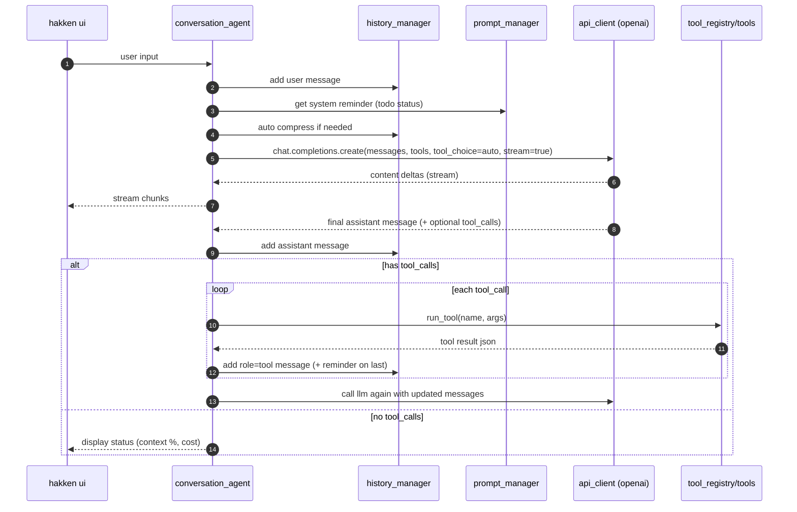

# hakken
> [!IMPORTANT]
> hakken is an ai agent which needs a lot of context to provide `good` intelligent assistance.
> 
> this is like a claude-code but `opensource` hehe and i have built this from scratch. 


## agent capabilities

> `chat` — context awareness and message compression
>
> `todo` - it plan first ; create todo list and follow it. 
> 
> `streaming` — real‑time interrupts (/stop or inline) ; interrupts to change the plan
>
> `tools` — terminal commands, file read/edit, project grep, git ops, todos, task memory, task delegation
>
> `context` — smart context cropping, prompt management
>
> `tokens` — budgeting with context window limits and output caps
>
> `status` — cost tracking, status display


## data flow 




## Installation

### Option 1: Global Install (Use from anywhere)
Install globally with uv:

```bash
git clone https://github.com/saurabhaloneai/hakken.git
cd hakken
uv tool install -e .
```

### Option 2: Local Development
Install dependencies only (run from project directory):

```bash
git clone https://github.com/saurabhaloneai/hakken.git
cd hakken
uv sync
```

## Setup

1. **Copy the environment template:**
   ```bash
   cp .env.example .env
   ```

2. **Configure your API settings** by editing `.env`:

   **Option A: Using OpenRouter (Recommended - Free models available)**
   ```bash
   # Get a free API key from https://openrouter.ai/
   OPENAI_API_KEY=your-openrouter-api-key-here
   OPENAI_BASE_URL=https://openrouter.ai/api/v1
   OPENAI_MODEL=meta-llama/llama-3.1-8b-instruct:free
   ```

   **Option B: Using OpenAI directly**
   ```bash
   OPENAI_API_KEY=sk-your-openai-api-key-here
   OPENAI_BASE_URL=https://api.openai.com/v1
   OPENAI_MODEL=gpt-4o-mini
   ```

## Usage

### If you installed with Option 1 (Global Install):
Run hakken from anywhere:

```bash
hakken
```

**Note:** You'll need to copy the `.env` file to your project directory or set environment variables globally.

### If you installed with Option 2 (Local Development):
Run hakken from the project directory:

```bash
uv run hakken
```

The agent will start an interactive conversation where you can ask questions and get contextual assistance.

**Important:** Make sure your `.env` file is properly configured before running hakken!


## todo 

- [ ] add the human in loop 
- [ ] improve the ui 
- [ ] smart context manager 