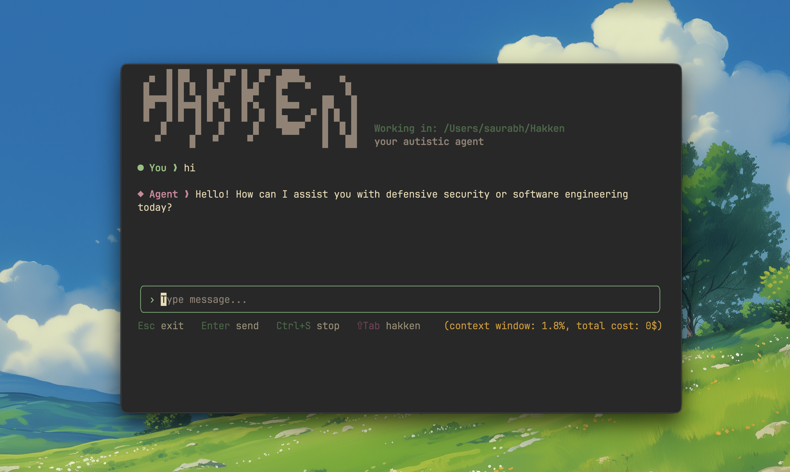

# hakken | 発見

>[!IMPORTANT]
>
> An interactive CLI AI agent(llm in feedback-loop) that suppose to help you with coding tasks.
>
> I have built this project to understand about agents work and how to build effective agents.



## features

- **Tool Integration** - File system operations, web search, command execution
- **Permission System** - Tool usage requires explicit approval
- **Markdown Support** - Rich text rendering with syntax highlighting
- **Human in the loop** - Agent will ask for approval to use tools and you ask stop agent if you want to stop the agent and give feedback to the agent.
- [ ] Memory 
- [ ] Long Context Management
- [ ] Evaluation 

## setup

1. Clone the repository:
```bash
git clone https://github.com/yourusername/hakken.git
cd hakken
```

2. Install Python dependencies:
```bash
uv sync
```

3. Install Node dependencies:
```bash
cd hakken-agent
npm install
```

4. Create `.env` file with your OpenAI API key:
```bash
cp .env.example .env
# Edit .env and add your OPENAI_API_KEY
```
5. Run the agent:
```bash
hakken
```


## license

MIT License - see LICENSE file for details


