# hakken | 発見
> [!IMPORTANT]
> hakken is an ai agent which needs a lot of context to provide `good` intelligent assistance.
> 
> this is like a claude-code and i have built this from scratch.
 


## agent capabilities

> `chat` — conversation with automatic message compression and context awareness
>
> `planning` — mandatory todo creation for complex tasks (4+ steps) with persistent todo.md tracking
> 
> `streaming` — real-time response streaming with ESC-key interrupts for mid-conversation redirection
>
> `tools` — comprehensive toolkit: terminal commands, file operations, project search, git workflows, web search, task memory, and specialized sub-agent delegation
>
> `context` — smart context cropping with user approval, intelligent prompt management, and environment-aware reminders
>
> `memory` — persistent task memory across sessions with similarity search and context recall
>
> `tokens` — token budgeting with context window optimization and output caps
>
> `status` — real-time cost tracking, context usage monitoring, and session statistics


## data flow 

```mermaid
graph TB
    %% User Entry Points
    User[👤 User] 
    CLI[🖥️ CLI Entry Point]
    
    %% Main Components
    Agent[🤖 Agent Core]
    UI[🎨 HakkenCodeUI]
    API[🌐 APIClient]
    History[📚 HistoryManager]
    Tools[🔧 ToolManager]
    Prompts[📝 PromptManager]
    
    %% Tool Types
    subgraph ToolTypes[🛠️ Available Tools]
        FileOps[📁 File Operations<br/>FileReader, FileEditor]
        Search[🔍 Search Tools<br/>GrepSearch, WebSearch]
        System[⚙️ System Tools<br/>CommandRunner, GitTools]
        Task[📋 Task Tools<br/>TodoWriter, TaskDelegator]
        Memory[🧠 Memory Tools<br/>TaskMemory, ContextCropper]
    end
    
    %% Data Flow Connections
    User --> CLI
    CLI --> Agent
    Agent --> UI
    Agent --> API
    Agent --> History
    Agent --> Tools
    Agent --> Prompts
    
    Tools --> ToolTypes
    
    %% Feedback loops
    API -.-> Agent
    Tools -.-> Agent
    UI -.-> User
    History -.-> Agent
    
    style Agent fill:#ff6b35,stroke:#fff,stroke-width:3px,color:#fff
    style User fill:#00d4ff,stroke:#fff,stroke-width:2px,color:#fff
    style ToolTypes fill:#00ff88,stroke:#fff,stroke-width:2px,color:#000
```



> [!NOTE]
> the current implmenation have some extra code which is not required if you are using good model lile sonnet-4
> 

## installation

### Option 1: Global Install (Use from anywhere)
Install globally with uv:

```bash
git clone https://github.com/saurabhaloneai/hakken.git
cd hakken
uv tool install -e .
```

### Option 2: Local Development
Install dependencies only (run from project directory):

```bash
git clone https://github.com/saurabhaloneai/hakken.git
cd hakken
uv sync
```

## setup

1. **Copy the environment template:**
   ```bash
   cp .env.example .env
   ```

2. **Configure your API settings** by editing `.env`:

   **Using OpenRouter (Recommended - Free models available)**
   ```bash
   # Get a free API key from https://openrouter.ai/
   OPENROUTER_API_KEY=your-openrouter-api-key-here
   OPENAI_BASE_URL=https://openrouter.ai/api/v1
   OPENAI_MODEL=z-ai/glm-4.5-air:free
   ```

## usage

### If you installed with Option 1 (Global Install):
Run hakken from anywhere:

```bash
hakken
```

**Note:** You'll need to copy the `.env` file to your project directory or set environment variables globally.

### if you installed with Option 2 (Local Development):
run hakken from the project directory:

```bash
uv run hakken
```

the agent will start an interactive conversation where you can ask questions and get contextual assistance.

**Important:** Make sure your `.env` file is properly configured before running hakken!


## todo 

- [in process] add tutorials 
- [ ] improve the ui 
