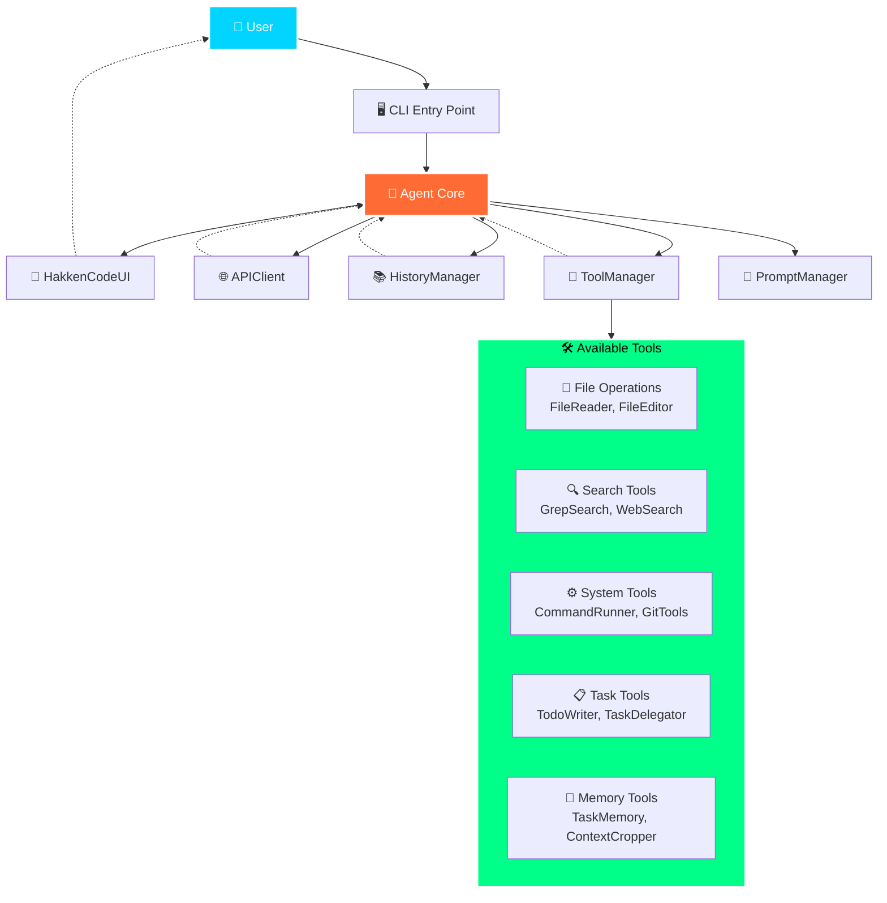
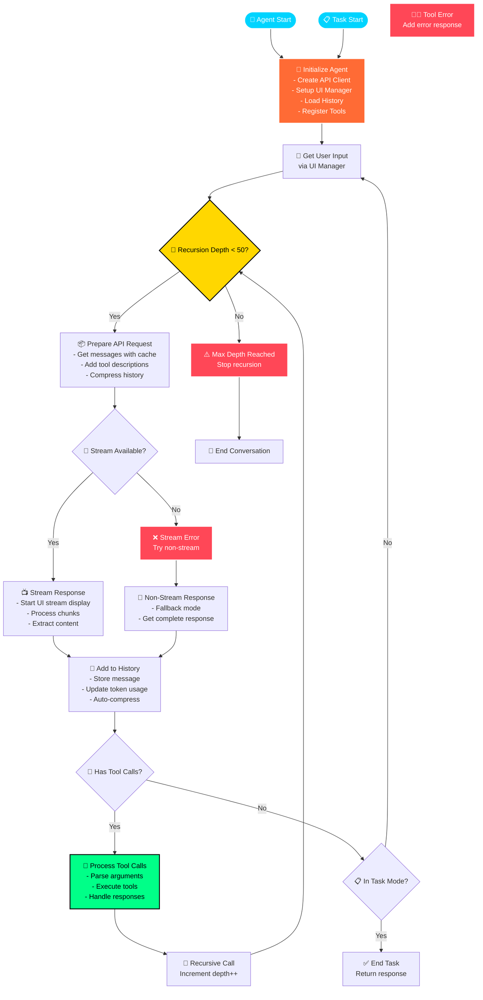
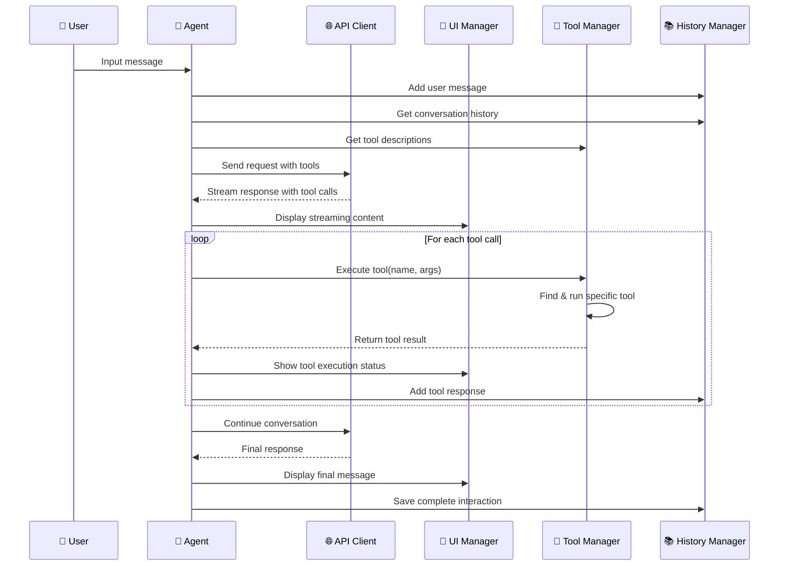
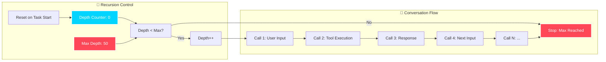
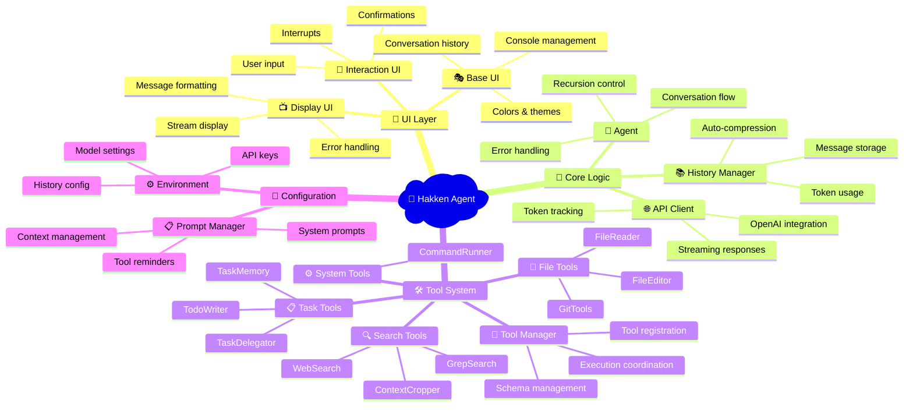

# Hakken Agent Data Flow Diagram

## main architecture overview

```mermaid
graph TB
    %% User Entry Points
    User[👤 User] 
    CLI[🖥️ CLI Entry Point]
    
    %% Main Components
    Agent[🤖 Agent Core]
    UI[🎨 HakkenCodeUI]
    API[🌐 APIClient]
    History[📚 HistoryManager]
    Tools[🔧 ToolManager]
    Prompts[📝 PromptManager]
    
    %% Tool Types
    subgraph ToolTypes[🛠️ Available Tools]
        FileOps[📁 File Operations<br/>FileReader, FileEditor]
        Search[🔍 Search Tools<br/>GrepSearch, WebSearch]
        System[⚙️ System Tools<br/>CommandRunner, GitTools]
        Task[📋 Task Tools<br/>TodoWriter, TaskDelegator]
        Memory[🧠 Memory Tools<br/>TaskMemory, ContextCropper]
    end
    
    %% Data Flow Connections
    User --> CLI
    CLI --> Agent
    Agent --> UI
    Agent --> API
    Agent --> History
    Agent --> Tools
    Agent --> Prompts
    
    Tools --> ToolTypes
    
    %% Feedback loops
    API -.-> Agent
    Tools -.-> Agent
    UI -.-> User
    History -.-> Agent
    
    style Agent fill:#ff6b35,stroke:#fff,stroke-width:3px,color:#fff
    style User fill:#00d4ff,stroke:#fff,stroke-width:2px,color:#fff
    style ToolTypes fill:#00ff88,stroke:#fff,stroke-width:2px,color:#000
```

## Detailed Agent Conversation Flow

```mermaid
flowchart TD
    %% Start Points
    Start([🚀 Agent Start])
    TaskStart([📋 Task Start])
    
    %% Decision Points
    RecurCheck{🔄 Recursion Depth < 50?}
    StreamCheck{📡 Stream Available?}
    ToolCheck{🔧 Has Tool Calls?}
    TaskMode{📋 In Task Mode?}
    
    %% Processing Blocks
    InitAgent[🤖 Initialize Agent<br/>- Create API Client<br/>- Setup UI Manager<br/>- Load History<br/>- Register Tools]
    
    GetInput[📝 Get User Input<br/>via UI Manager]
    
    PrepRequest[📦 Prepare API Request<br/>- Get messages with cache<br/>- Add tool descriptions<br/>- Compress history]
    
    StreamResp[📺 Stream Response<br/>- Start UI stream display<br/>- Process chunks<br/>- Extract content]
    
    NonStreamResp[📄 Non-Stream Response<br/>- Fallback mode<br/>- Get complete response]
    
    ProcessTools[🔧 Process Tool Calls<br/>- Parse arguments<br/>- Execute tools<br/>- Handle responses]
    
    AddMessage[💾 Add to History<br/>- Store message<br/>- Update token usage<br/>- Auto-compress]
    
    RecurCall[🔄 Recursive Call<br/>Increment depth++]
    
    EndTask[✅ End Task<br/>Return response]
    EndConvo[🏁 End Conversation]
    
    %% Error Handling
    RecurError[⚠️ Max Depth Reached<br/>Stop recursion]
    StreamError[❌ Stream Error<br/>Try non-stream]
    ToolError[🔧❌ Tool Error<br/>Add error response]
    
    %% Flow Connections
    Start --> InitAgent
    TaskStart --> InitAgent
    InitAgent --> GetInput
    GetInput --> RecurCheck
    
    RecurCheck -->|Yes| PrepRequest
    RecurCheck -->|No| RecurError
    RecurError --> EndConvo
    
    PrepRequest --> StreamCheck
    
    StreamCheck -->|Yes| StreamResp
    StreamCheck -->|No| StreamError
    StreamError --> NonStreamResp
    
    StreamResp --> AddMessage
    NonStreamResp --> AddMessage
    
    AddMessage --> ToolCheck
    
    ToolCheck -->|Yes| ProcessTools
    ToolCheck -->|No| TaskMode
    
    ProcessTools --> RecurCall
    RecurCall --> RecurCheck
    
    TaskMode -->|Yes| EndTask
    TaskMode -->|No| GetInput
    
    %% Styling
    style Start fill:#00d4ff,stroke:#fff,stroke-width:2px,color:#fff
    style TaskStart fill:#00d4ff,stroke:#fff,stroke-width:2px,color:#fff
    style InitAgent fill:#ff6b35,stroke:#fff,stroke-width:2px,color:#fff
    style RecurCheck fill:#ffd700,stroke:#000,stroke-width:2px,color:#000
    style ProcessTools fill:#00ff88,stroke:#000,stroke-width:2px,color:#000
    style RecurError fill:#ff4757,stroke:#fff,stroke-width:2px,color:#fff
    style StreamError fill:#ff4757,stroke:#fff,stroke-width:2px,color:#fff
    style ToolError fill:#ff4757,stroke:#fff,stroke-width:2px,color:#fff
```

## Tool Execution Flow

```mermaid
sequenceDiagram
    participant User as 👤 User
    participant Agent as 🤖 Agent
    participant API as 🌐 API Client
    participant UI as 🎨 UI Manager
    participant Tools as 🔧 Tool Manager
    participant History as 📚 History Manager
    
    User->>Agent: Input message
    Agent->>History: Add user message
    Agent->>History: Get conversation history
    Agent->>Tools: Get tool descriptions
    Agent->>API: Send request with tools
    
    API-->>Agent: Stream response with tool calls
    Agent->>UI: Display streaming content
    
    loop For each tool call
        Agent->>Tools: Execute tool(name, args)
        Tools->>Tools: Find & run specific tool
        Tools-->>Agent: Return tool result
        Agent->>UI: Show tool execution status
        Agent->>History: Add tool response
    end
    
    Agent->>API: Continue conversation
    API-->>Agent: Final response
    Agent->>UI: Display final message
    Agent->>History: Save complete interaction
```

## Recursion Depth Management

```mermaid
graph LR
    subgraph Recursion[🔄 Recursion Control]
        Depth[Depth Counter: 0]
        Max[Max Depth: 50]
        Check[Depth < Max?]
        Increment[Depth++]
        Reset[Reset on Task Start]
    end
    
    subgraph Flow[💫 Conversation Flow]
        Call1[Call 1: User Input]
        Call2[Call 2: Tool Execution]
        Call3[Call 3: Response]
        Call4[Call 4: Next Input]
        CallN[Call N: ...]
        Stop[Stop: Max Reached]
    end
    
    Depth --> Check
    Max --> Check
    Check -->|Yes| Increment
    Check -->|No| Stop
    Increment --> Call1
    Call1 --> Call2
    Call2 --> Call3
    Call3 --> Call4
    Call4 --> CallN
    CallN --> Stop
    Reset --> Depth
    
    style Depth fill:#00d4ff,stroke:#fff,stroke-width:2px,color:#fff
    style Max fill:#ff4757,stroke:#fff,stroke-width:2px,color:#fff
    style Stop fill:#ff4757,stroke:#fff,stroke-width:2px,color:#fff
```

## Component Interaction Map

```mermaid
mindmap
  root)🤖 Hakken Agent(
    🎨 UI Layer
      📺 Display UI
        Message formatting
        Stream display
        Error handling
      📝 Interaction UI
        User input
        Confirmations
        Interrupts
      🎭 Base UI
        Colors & themes
        Console management
        Conversation history
    
    🧠 Core Logic
      🤖 Agent
        Conversation flow
        Recursion control
        Error handling
      🌐 API Client
        OpenAI integration
        Streaming responses
        Token tracking
      📚 History Manager
        Message storage
        Auto-compression
        Token usage
    
    🛠️ Tool System
      🔧 Tool Manager
        Tool registration
        Execution coordination
        Schema management
      📁 File Tools
        FileReader
        FileEditor
        GitTools
      🔍 Search Tools
        GrepSearch
        WebSearch
        ContextCropper
      📋 Task Tools
        TodoWriter
        TaskDelegator
        TaskMemory
      ⚙️ System Tools
        CommandRunner
    
    📝 Configuration
      📋 Prompt Manager
        System prompts
        Tool reminders
        Context management
      ⚙️ Environment
        API keys
        Model settings
        History config
```

