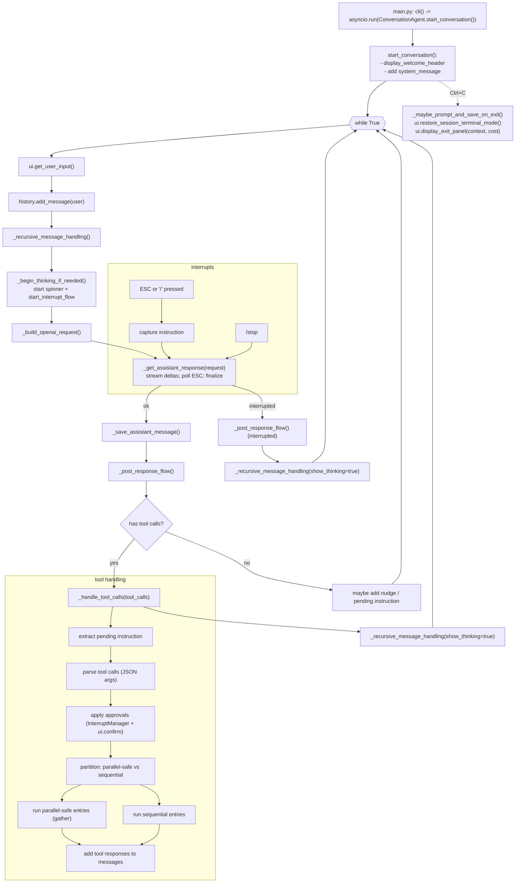

```mermaid
flowchart TD
  %% entry
  main["main.py: cli() -> asyncio.run(ConversationAgent.start_conversation())"] --> startConv

  %% start conversation & outer loop
  startConv["start_conversation():\n- display_welcome_header\n- add system_message"] --> loop{{"while True"}}
  loop --> getUser["ui.get_user_input()"] --> addUserMsg["history.add_message(user)"] --> handle["_recursive_message_handling()"]

  %% recursive handling (think -> act -> observe)
  handle --> beginThinking["_begin_thinking_if_needed()\nstart spinner + start_interrupt_flow"]
  beginThinking --> buildReq["_build_openai_request()"] --> getResp["_get_assistant_response(request)\nstream deltas; poll ESC; finalize"]

  %% outcomes of get_assistant_response
  getResp -->|"ok"| saveMsg["_save_assistant_message()"] --> postFlow["_post_response_flow()"]
  getResp -->|"interrupted"| postFlowInt["_post_response_flow() (interrupted)"]

  %% post-response flow
  postFlow --> hasTools{has tool calls?}
  hasTools -- "yes" --> handleTools["_handle_tool_calls(tool_calls)"] --> recurse["_recursive_message_handling(show_thinking=true)"] --> loop
  hasTools -- "no" --> maybeNudge["maybe add nudge / pending instruction"] --> loop

  %% interrupted flow
  postFlowInt --> recurse2["_recursive_message_handling(show_thinking=true)"] --> loop

  %% tool handling details
  subgraph tool_handling [tool handling]
    direction TB
    handleTools --> extract["extract pending instruction"]
    extract --> parse["parse tool calls (JSON args)"]
    parse --> approvals["apply approvals (InterruptManager + ui.confirm)"]
    approvals --> partition["partition: parallel-safe vs sequential"]
    partition --> runPar["run parallel-safe entries (gather)"]
    partition --> runSeq["run sequential entries"]
    runPar --> addResp["add tool responses to messages"]
    runSeq --> addResp
  end

  %% interrupts during streaming
  subgraph interrupts [interrupts]
    direction TB
    esc["ESC or '/' pressed"] --> capture["capture instruction"] --> getResp
    stop["/stop"] --> getResp
  end

  %% exit path
  startConv -. Ctrl+C .-> onExit["_maybe_prompt_and_save_on_exit()\nui.restore_session_terminal_mode()\nui.display_exit_panel(context, cost)"]
```

