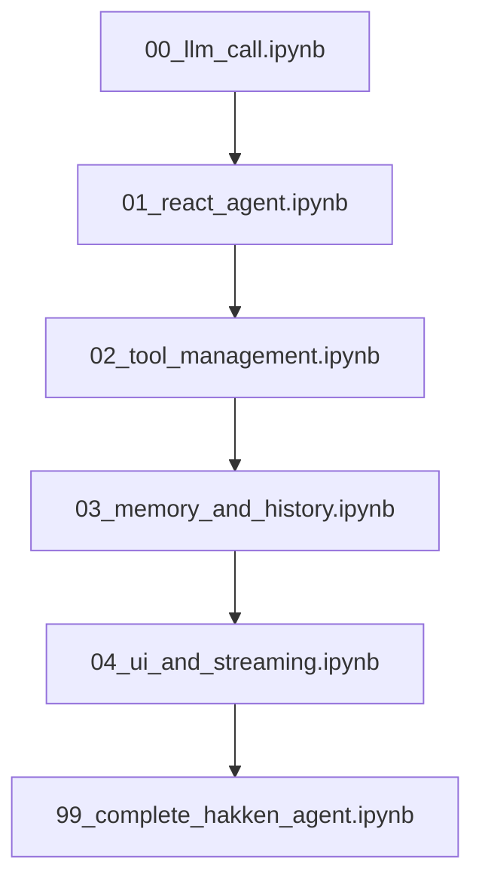

# 🤖 AI Agent Development Course: From Basic LLM to Hakken-Level Agents

Welcome to the most comprehensive course on building production-ready AI agents! This course takes you from basic LLM function calling to sophisticated agent architectures like Hakken.

## 🎯 What You'll Build

By the end of this course, you'll have built a complete AI agent with:
- **Intelligent reasoning** using the ReAct pattern
- **Advanced tool management** with security and approvals  
- **Smart memory systems** for long conversations
- **Professional interfaces** with streaming and rich formatting
- **Production-ready architecture** inspired by Hakken

## 📚 Course Structure

### 🏁 Start Here: Basic Foundation
- **[Chapter 0: Basic LLM Function Calling](00_llm_call.ipynb)** ✅
  - OpenAI API integration
  - Simple function calling
  - Tool mapping and execution

### 🧠 Core Agent Patterns  
- **[Chapter 1: ReAct Agent Pattern](01_react_agent.ipynb)** ✅
  - Reasoning + Acting loops
  - Multi-step tool chaining
  - Conversation state management

### 🔧 Production Systems
- **[Chapter 2: Advanced Tool Management](02_tool_management.ipynb)** ✅
  - Tool architecture with security
  - Risk assessment and approvals
  - Dynamic tool registration

### 🧠 Memory & Context
- **[Chapter 3: Memory and History Management](03_memory_and_history.ipynb)** ✅
  - Conversation compression
  - Context window optimization
  - Memory systems

### 🖥️ Professional Interface
- **[Chapter 4: UI and Streaming](04_ui_and_streaming.ipynb)** ✅
  - Real-time streaming responses
  - Rich terminal interfaces
  - Human-in-the-loop patterns

### 🏗️ Complete System
- **[Chapter 99: Complete Hakken-Style Agent](99_complete_hakken_agent.ipynb)** ✅
  - Full agent integration
  - Production deployment patterns
  - Real-world capabilities

## 🚀 Quick Start

1. **Setup your environment:**
   ```bash
   cd notebooks/
   pip install openai tavily-python rich textual python-dotenv
   ```

2. **Configure your API keys in `.env`:**
   ```
   OPENROUTER_API_KEY=your_key_here
   TAVILY_API_KEY=your_key_here  
   OPENAI_MODEL=anthropic/claude-3.5-sonnet
   ```

3. **Start with the first notebook:**
   ```bash
   jupyter notebook 00_llm_call.ipynb
   ```

## 🎓 Learning Path



Each notebook builds on the previous ones, introducing one core concept at a time.

## 🛠️ Technologies Used

- **OpenAI API**: Core LLM integration via OpenRouter
- **Tavily**: Web search capabilities
- **Rich/Textual**: Beautiful terminal interfaces
- **Python Async**: Modern async/await patterns
- **Type Hints**: Production-ready code patterns

## 📖 Key Concepts Covered

### Foundation Level
- LLM function calling mechanics
- Tool mapping and execution
- Basic error handling
- API integration patterns

### Intermediate Level  
- ReAct reasoning patterns
- Conversation state management
- Tool categorization and security
- Memory and context compression

### Advanced Level
- Production-ready architectures
- Streaming interfaces and UX
- Human-in-the-loop workflows
- Performance optimization

### Expert Level
- Complete agent systems
- Deployment patterns
- Security and safety
- Real-world applications

## 🎯 Learning Outcomes

After completing this course, you will:

1. **Understand** the fundamental patterns behind AI agents
2. **Build** production-ready tool management systems
3. **Implement** sophisticated memory and conversation handling
4. **Create** professional user interfaces for agents
5. **Deploy** complete agent systems with confidence
6. **Apply** security and safety best practices
7. **Architect** scalable agent solutions

## 🌟 What Makes This Course Special

### Progressive Complexity
- Start simple, build understanding gradually
- Each concept builds on the previous
- Always see working, runnable code

### Production-Ready Code
- Industry best practices
- Type hints and error handling
- Async/await patterns
- Security considerations

### Real-World Focus
- Based on actual agent architectures (Hakken)
- Practical examples and use cases
- Production deployment considerations

### Hands-On Learning
- Interactive Jupyter notebooks
- Immediate feedback and results
- Build real tools you can use

## 🔧 Prerequisites

- **Python Knowledge**: Intermediate level
- **Async Programming**: Basic understanding of async/await
- **APIs**: Experience with REST APIs
- **Command Line**: Basic terminal usage

## 🎨 Real-World Applications

This course prepares you to build:

- **Development Tools**: Code assistants like Cursor/GitHub Copilot
- **Research Agents**: Automated data gathering and analysis
- **Task Automation**: Intelligent workflow automation
- **CLI Tools**: Professional command-line interfaces with AI
- **Customer Service**: Smart bots with tool access
- **Personal Assistants**: AI helpers with file/system access

## 🤝 Course Philosophy

### Learn by Building
Every concept is taught through building real, working code. You'll see immediate results and understand how each piece fits together.

### Production-First
We don't just teach toy examples. Every pattern and technique is designed for real-world use.

### Safety-Focused
Security and safety are built in from the beginning, not added as an afterthought.

### Modular Design
Each component is designed to be reusable and extensible, following software engineering best practices.

## 📊 Course Progress Tracking

- [ ] **Chapter 0**: Basic LLM function calling
- [ ] **Chapter 1**: ReAct agent patterns
- [ ] **Chapter 2**: Tool management systems
- [ ] **Chapter 3**: Memory and conversation handling
- [ ] **Chapter 4**: UI and streaming interfaces
- [ ] **Chapter 99**: Complete agent integration

## 🆘 Getting Help

If you get stuck:

1. **Check the notebook comments** - detailed explanations throughout
2. **Review the course outline** - understand how pieces fit together
3. **Run the code step by step** - each cell builds on the previous
4. **Modify and experiment** - best way to learn is by doing

## 🎉 What's Next?

After completing this course:

1. **Extend your agent** with custom tools
2. **Deploy to production** using the patterns learned
3. **Contribute to open source** agent projects
4. **Build your own agent startup** 🚀

---

**Ready to build the future of AI agents?** Start with [Chapter 0: Basic LLM Function Calling](00_llm_call.ipynb) and begin your journey!

*This course is inspired by and teaches patterns from Hakken and other production AI agent systems.*
