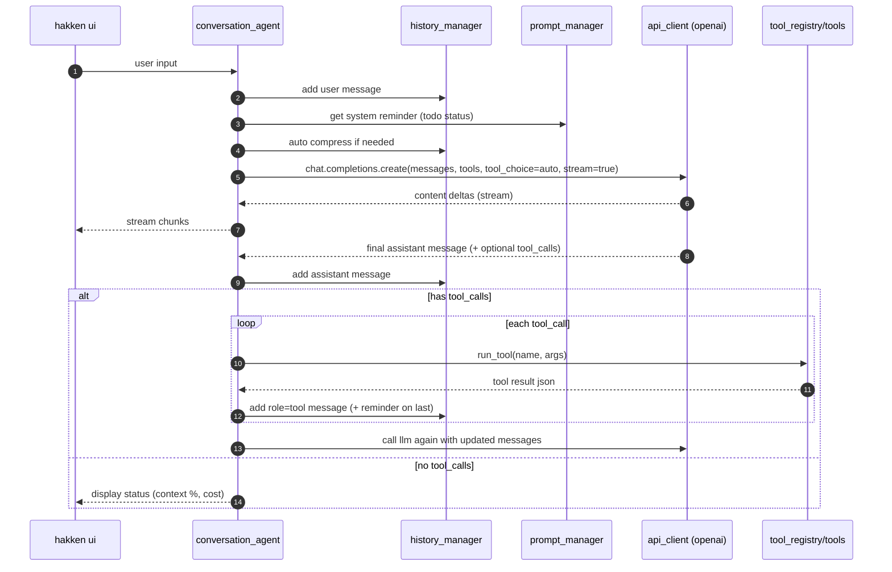

## overview of hakken

this doc explains, end-to-end, how user inputs, llm calls, tool executions, and todo updates flow through the hakken runtime. it also shows how the streaming/interrupt loop works.

## high-level lifecycle

1. startup
   - `src/main.py` → `ConversationAgent.start_conversation()`.
   - ui shows the header (`HakkenCodeUI.display_welcome_header`).

2. system prompt seed
   - `PromptManager.get_system_prompt()` builds a system message from:
     - fixed rules (`SystemRuleProvider.get_system_rule`), and
     - live environment info (`EnvironmentCollector.collect_all`).
   - the agent pushes this as the first message into history.

3. user turns
   - ui collects input (`HakkenCodeUI.get_user_input`).
   - the agent appends a `{"role": "user", "content": ...}` message.

4. llm request assembly (core loop)
   - `ConversationAgent._recursive_message_handling()`:
     - gathers messages from `ConversationHistoryManager.get_current_messages()`.
     - annotates the last content with cache hints when applicable (`_get_messages_with_cache_mark`).
     - collects tool json-schemas via `ToolRegistry.get_tools_description()`.
     - computes safe output token cap (context budgeting).
     - builds the request:
       - `messages`: conversation history
       - `tools`: tool schemas (function-calling)
       - `tool_choice`: `auto`
       - `max_tokens`, `temperature`

5. streaming completion
   - `APIClient.get_completion_stream()` (in `src/client/openai_client.py`) calls `chat.completions.create(stream=True)` and yields:
     - text deltas (assistant content) for live printing via `HakkenCodeUI.stream_content`.
     - a final aggregated assistant message that may include `tool_calls`.
   - the ui shows a spinner/status during thinking and prints streamed text.

6. message storage and usage
   - streamed text is finalized (`HakkenCodeUI.finish_assistant_response`).
   - the agent appends the final assistant message (content + any tool_calls) to history.
   - token usage (and cost, if provided) is tracked via `ConversationHistoryManager.update_token_usage` and shown with `HakkenCodeUI.display_status`.

7. tool-call branch
   - if the assistant response contains function calls:
     - `_handle_tool_calls()` parses each tool call's `function.arguments` (json).
     - optional human approval is checked by `InterruptConfigManager.requires_approval(...)` and, if needed, prompts using `HakkenCodeUI.confirm_action`.
     - on approval, `ToolRegistry.run_tool(name, **args)` executes the tool's `act(...)` and returns a json-serializable result.
     - `_add_tool_response(...)` posts a `{"role":"tool", "tool_call_id":..., "name":..., "content":[...]}` message back into history so the next llm turn can use it.
     - importantly: if this was the last tool in the batch, a reminder text from `PromptManager.get_reminder()` is appended; that reminder embeds the current todo status when available (see below).
   - after tool execution, the agent immediately re-enters `_recursive_message_handling(show_thinking=False)` so the llm can read the tool results and continue; this repeats until there are no further tool calls.

8. idle branch
   - if there are no tool calls, the loop prints context/cost status and returns to wait for the next user input.

## how data reaches the llm

- the only place that actually calls the llm is `APIClient` in `src/client/openai_client.py`.
  - non-streaming path: `get_completion(request_params)` → returns `(message, token_usage)`.
  - streaming path: `get_completion_stream(request_params)` → yields text chunks and finally a full `ChatCompletionMessage` containing `content`, optional `tool_calls`, and usage (if available).
- the request payload is constructed in `ConversationAgent._recursive_message_handling()` and includes `messages`, `tools` (function schemas), `tool_choice: "auto"`, and token controls.
- `ConversationHistoryManager` is the single source of truth for the `messages` array passed to the llm.

## how tools execute (and how their data flows back)

tools are registered in `ConversationAgent._register_tools()` via `ToolRegistry`. each tool implements:

- `get_tool_name()` → the exposed function-calling name.
- `json_schema()` → the openai tool schema included in each llm request.
- `act(**kwargs)` → the async implementation the agent executes when the llm calls the tool.
- `get_status()` → a text status string.

execution flow:

1. llm responds with tool calls → `_handle_tool_calls(...)` → (optional) `confirm_action` → `ToolRegistry.run_tool(name, **args)` → `tool_instance.act(...)`.
2. the tool returns a result (usually a dict or string). the agent serializes it to json and posts a `role=tool` message via `_add_tool_response(...)`.
3. if it was the last tool in the batch, `_add_tool_response` appends a reminder from `PromptManager.get_reminder()`. that reminder pulls todo status and task memory context so the llm can see current progress and recent memory entries.
4. the agent re-enters `_recursive_message_handling(...)` so the llm can read the tool output and continue.

notable tools:

- `todo_write` (`src/tools/todo_writer.py`)
  - validates and saves a list of todos in memory inside the tool instance.
  - updates the ui using `HakkenCodeUI.display_todos(...)`.
  - exposes `get_status()` that returns the current todos as json.
  - this status is injected into the reminder used after the last tool call in a batch, so the llm can keep todo state in mind.

- `cmd_runner` (`src/tools/command_runner.py`)
  - executes shell commands (non-interactive) and returns stdout/stderr.

- `read_file` / `edit_file` (`src/tools/file_reader.py`, `src/tools/file_editor.py`)
  - read file contents with optional line range limits
  - edit files using search-and-replace operations

- `task_memory` (`src/tools/task_memory_tool.py`)
  - persistent memory for complex multi-session tasks
  - saves progress, decisions, context, and next steps to `.hakken/task_memory.jsonl`
  - three actions: save (store current state), recall (get recent context), similar (find related work)
  - automatically included in reminder system for llm context

- `web_search` (`src/tools/web_search.py`)
  - real-time web search using tavily api for current information
  - requires user approval before executing searches (privacy protection)
  - supports different search topics (general, news, finance)
  - includes raw content option for detailed research

- `grep_search` (`src/tools/grep_search.py`)
  - lightweight, bounded search across files.

- `git_status` (`src/tools/git_tools.py`)
  - read-only `status`/`diff`/`log` wrappers.

- `smart_context_cropper` (`src/tools/context_cropper.py`)
  - crops messages from the top or bottom while preserving the latest user message. updates are applied directly to `ConversationHistoryManager`.

- `delegate_task` (`src/tools/task_delegator.py`)
  - spins a nested task using a specialized sub-agent prompt; internally calls `ConversationAgent.start_task(...)` which runs the same loop in an isolated mini-chat and returns the final text.

## streaming, interrupts, and the loop

- streaming
  - while the llm streams, the ui prints chunks (`HakkenCodeUI.stream_content`).
  - first output chunk stops the spinner.

- interrupts
  - `HakkenCodeUI.start_interrupt_listener()` reads stdin in a background thread.
  - during streaming or tool execution, `_safe_poll_interrupt()` checks for user lines:
    - `/` (alone) switches to an inline instruction capture mode.
    - any other line is immediately treated as a new user message (prefixed with `[INTERRUPT]`).
  - `_handle_user_interrupt(...)` appends an extra `role=user` message and the agent recurses, letting the llm incorporate the instruction.

- recursion and termination
  - after every assistant or tool turn, `_recursive_message_handling(...)` re-runs.
  - if a turn produces tool calls → execute tools → append tool results → recurse.
  - if a turn produces no tool calls → show status → return control to the main loop awaiting the next user input.

## message structure (what the llm sees)

typical shapes inside `ConversationHistoryManager.messages_history[-1]`:

- system message
  - `{ "role": "system", "content": [{"type":"text", "text": "..."}] }`

- user message
  - `{ "role": "user", "content": [{"type":"text", "text": "..."}] }`

- assistant message (from streaming)
  - `{ "role": "assistant", "content": "full text", "tool_calls": [ ... ]? }`

- tool result message (what tools return to the llm)
  - `{ "role": "tool", "tool_call_id": "...", "name": "<tool_name>", "content": [ {"type":"text", "text": "<json string>"}, {"type":"text", "text": "<reminder with todos>"}? ] }`

## context budgeting and compression

- `_estimate_tokens(...)` approximates token counts for both messages and tool schemas.
- `_compute_max_output_tokens(...)` caps the output so request + response fits the `OPENAI_CONTEXT_LIMIT`.
- `ConversationHistoryManager.auto_messages_compression()` compresses when usage crosses `compress_threshold`:
  - compresses older turns while preserving the most recent user message(s), inserting a notice that prior content was compressed.
  - `smart_context_cropper` can also be invoked explicitly by the llm.

## todo and memory updates (how they appear to the llm and user)

- when `todo_write` runs, it:
  - validates the list, stores it in memory, and calls `HakkenCodeUI.display_todos` so the user sees a nicely formatted panel.
  - returns a success string to the llm (as a tool result).
- when `task_memory` runs with action="save", it:
  - stores progress, decisions, and context to `.hakken/task_memory.jsonl` for persistence across sessions
  - enables future recall of important context and decisions made during complex tasks
- after the last tool in a batch, `_add_tool_response` appends a reminder from `PromptManager.get_reminder()`:
  - this reminder pulls both `TodoWriteManager.get_status()` and `TaskMemoryTool.get_status()` 
  - embeds current todos and recent memory entry count into the tool message content
  - the effect: the llm always has the latest todo state and memory context in-context for better continuity

## quick reference (files and responsibilities)

- core
  - `src/agent/conversation_agent.py`: request assembly, streaming handling, tool execution, recursion, interrupts.
  - `src/history/conversation_history.py`: message store, compression, cropping, token usage.
  - `src/client/openai_client.py`: the only llm caller; streaming/non-streaming wrappers; cost aggregation.
  - `src/prompt/prompt_manager.py`: system rules, environment info, todo reminder injection.
  - `src/interface/user_interface.py`: streaming output, spinners, interrupts, todo display, confirmations.

- tools (selected)
  - `src/tools/todo_writer.py`: create/update todos and expose status.
  - `src/tools/command_runner.py`: run shell.
  - `src/tools/file_reader.py`, `src/tools/file_editor.py`: read/edit files.
  - `src/tools/grep_search.py`: content search.
  - `src/tools/git_tools.py`: git status/diff/log.
  - `src/tools/context_cropper.py`: crop history safely.
  - `src/tools/task_delegator.py`: nested sub-agent tasks.
  - `src/tools/task_memory_tool.py`: persistent memory for complex tasks.
  - `src/tools/web_search.py`: real-time web search with user approval.

## sequence (mermaid)

## environment variables

**required:**
- `OPENAI_API_KEY`, `OPENAI_BASE_URL`, `OPENAI_MODEL` (required by `APIConfiguration.from_environment`).

**optional llm tuning:**
- `OPENAI_MAX_OUTPUT_TOKENS`, `OPENAI_CONTEXT_LIMIT`, `OPENAI_OUTPUT_BUFFER_TOKENS`, `OPENAI_TEMPERATURE`.

**optional tool configuration:**
- `TAVILY_API_KEY`: required for web search functionality via `web_search` tool. get from https://tavily.com
- without this key, web search tool will show "api key not configured" status and fail gracefully

## faq

- how are todos kept in sync between ui and llm?
  - the `todo_write` tool updates the ui immediately and exposes current state via `get_status()`. that status is injected into a reminder appended to the last tool result so the llm sees the live list next turn.

- where exactly is the llm called?
  - only in `src/client/openai_client.py` (`get_completion` and `get_completion_stream`). the agent constructs the request and consumes the response, but the network call lives there.

- what ends the tool/llm loop?
  - a turn with no `tool_calls`. the agent then prints status and waits for the next user prompt.

